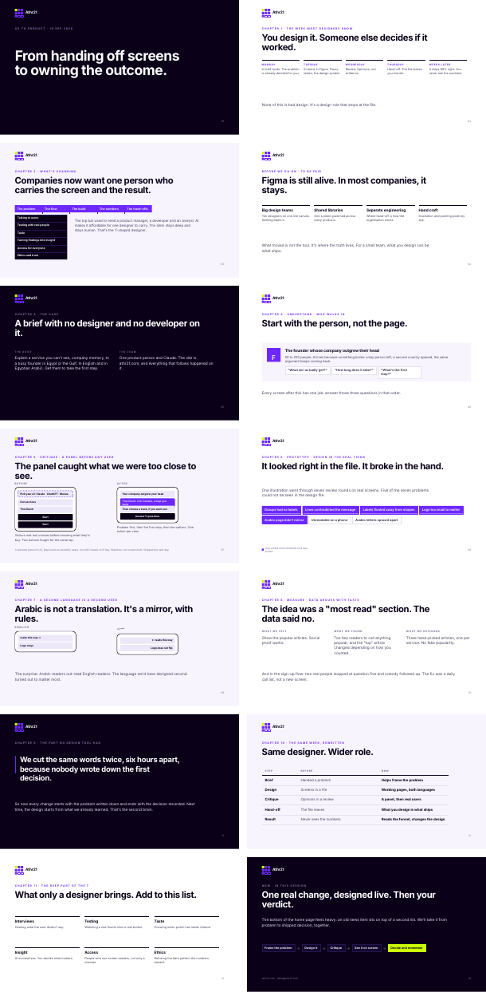
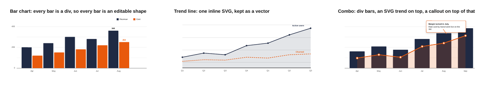
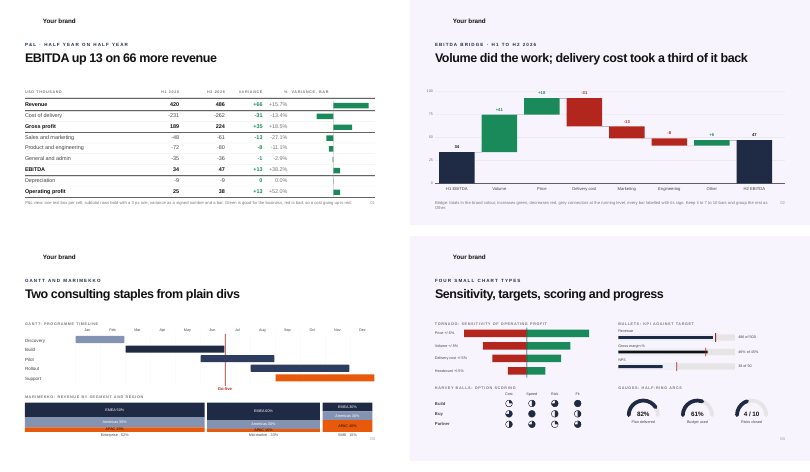

# HTML to PPTX

Turn HTML slides into an editable PowerPoint on your own machine.



The example is a real talk by [Athr21](https://athr21.com) on how a company builds its second brain, originally written as a scrolling web page. `examples/example-deck.html` is that deck rewritten in the export-safe form this skill teaches; `examples/example-deck.pptx` is the export, untouched.

## Credits

This is a thin wrapper. All the hard work is upstream:

- **[dom-to-pptx](https://github.com/atharva9167j/dom-to-pptx)** by Atharva Dharmendra Jagtap and contributors, MIT. The HTML to PPTX engine, the headless exporter (`dom-to-pptx-exporter`) and the original `dom-to-pptx-skills` package that this SKILL.md and `reference/STYLE_RULES.md` are condensed from.
- [PptxGenJS](https://github.com/gitbrent/PptxGenJS), [Puppeteer](https://pptr.dev) and [JSZip](https://stuk.github.io/jszip/), which dom-to-pptx builds on.

What this repo adds: a brand template, `check.mjs` (pre-export lint), `export.mjs` (vector SVG export plus file properties, working around two CLI gaps in 2.1.2), a tested example deck, pinned versions, and the security notes below. Version 2.1.2 of dom-to-pptx was the basis; the skill and rules were tested against it on 16 Sep 2026.

## Install as a Claude skill

Zip this folder and upload it under Customize > Skills > + > Create skill > Upload a skill. Then ask Claude for a deck and it will follow `SKILL.md`.

## Use from the terminal

```bash
npm install                                     # once
node check.mjs examples/example-deck.html       # pre-flight, regex
node overflow.mjs examples/example-deck.html    # pre-flight, headless Chrome: text that will wrap
node export.mjs examples/example-deck.html example-deck.pptx "The Source of Truth Moved" "Athr21"
```

Charts work too: bars as divs (editable shapes), lines as inline SVG (kept as vectors, Convert to Shape in PowerPoint), and layered combos.



And the consulting set: P&L view with variance bars, EBITDA bridge, gantt, marimekko, tornado, bullets, Harvey balls, gauges (`examples/charts-gallery.html`).



Open `example-deck.pptx` in PowerPoint. Copy `examples/example-deck.html` as the starting point for a new deck.

## What is in here

| File | What it is |
|---|---|
| `SKILL.md` | The instructions Claude follows: brand rules, HTML rules, export command, security notes |
| `reference/BRAND_TEMPLATE.md` | Copy to `BRAND.md` and fill in your palette, type, logo and layout rules |
| `reference/STYLE_RULES.md` | What CSS converts and what does not |
| `export.mjs` | The export command: keeps SVG charts as vectors, switches off shape autofit, sets title and author (all things the stock CLI gets wrong) |
| `overflow.mjs` | Opens the deck in headless Chrome and lists text that spills out of its box, which PowerPoint would wrap |
| `meta.mjs` | Title, author and autofit fix, used by `export.mjs`; also runs on its own on an existing .pptx |
| `check.mjs` | Pre-export check for the things that break silently. `node check.test.mjs` runs its self-test |
| `examples/` | The 14-slide Athr21 deck, three basic chart slides and a four-slide consulting chart gallery: source HTML, exported .pptx, and a contact sheet of each |
| `package.json` | Pinned versions of the exporter and headless browser |

## Security in one paragraph

Everything runs locally; slide content is never uploaded. Only export HTML you or a colleague wrote, because the exporter opens it in a browser with local file access on. Use PNG/JPG/SVG images you own. Speaker notes and author metadata are stored inside the .pptx.
